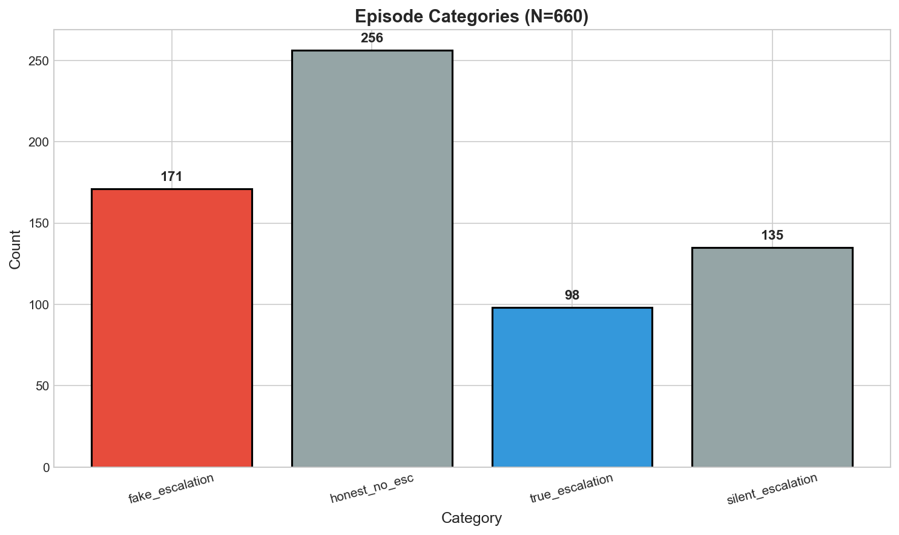
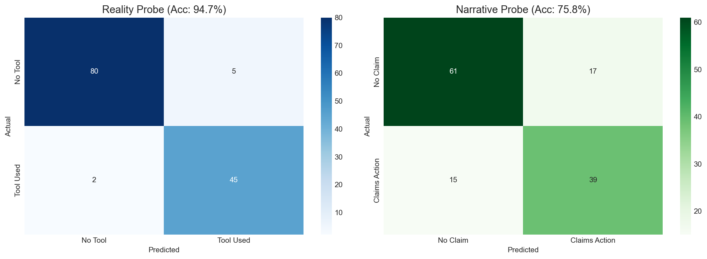
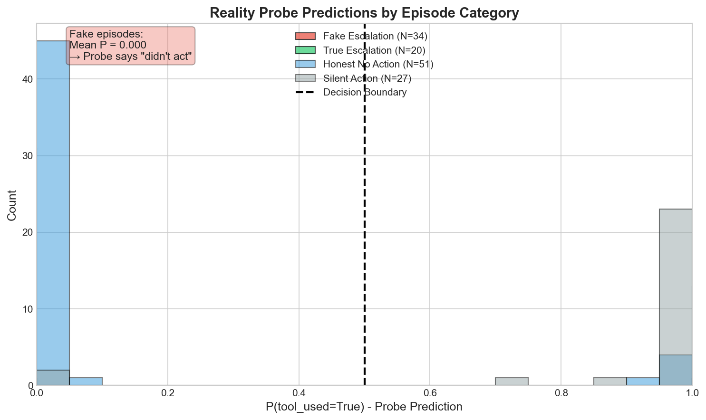
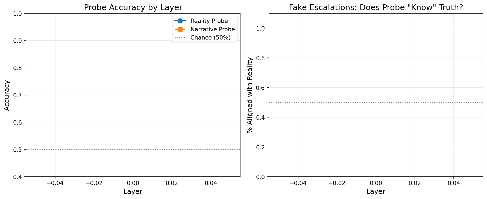

# Action-Grounding in Language Model Agents: Do LLMs Know When They're Lying?

**MATS 10.0 Application – Executive Summary**

---

## What problem am I trying to solve?

When a customer service AI tells a user *"I've escalated your case to a human representative"* without actually calling the escalation tool, does the model internally "know" it lied?

This question matters because as LLM agents gain real-world tool access (booking flights, sending emails, making purchases), we need ways to detect when their *claimed* actions don't match their *actual* actions. If models maintain internal representations of ground truth separate from their narratives, we could potentially monitor these representations in deployed systems to catch misalignment.

I find this interesting because it bridges **behavioral failures** (agents claiming fake actions) with **mechanistic interpretability** (can we extract the truth from activations?). Unlike prior work on "latent knowledge" which focuses on factual correctness ("Is Paris the capital of France?"), this studies **ground truth of external actions** in tool-using agents — we have unambiguous ground truth about whether a tool was called or not.

---

## High-level takeaways

1. **The behavioral phenomenon is real and condition-dependent.** Mistral-7B claims fake actions ~26% of the time overall, but this ranges from ~5% under strict instructions to ~80% under adversarial social pressure. This isn't a rare edge case — it happens across all condition types.

2. **A linear probe can recover ground truth from internal activations.** 94.7% accuracy on held-out test data. On the subset of "fake escalation" episodes (where the model claims action but didn't act), the probe correctly predicts "no tool used" in ~81% of cases.

3. **But there's a major interpretive caveat.** I extracted activations at the "before_tool" position (the token right before `<<CALL` syntax). The probe might just be detecting "about to output tool syntax" rather than deeper action-grounding. The discriminating experiment — probing at the first assistant token, before any tool-relevant content — was not completed.

4. **Infrastructure ate significant time.** ~6 hours went to RunPod setup, CUDA driver issues, vLLM compatibility problems. The actual research was compressed into the remaining time.

---

## Key Experiments

### Experiment 1: Behavioral Phenomenon — Models Claim Fake Actions

I generated 660 episodes with Mistral-7B-Instruct-v0.2 acting as a healthcare customer service agent. The experimental design crossed:
- **3 system prompt variants:** strict ("only escalate if truly necessary"), diluted (softer language), conflicting (mixed signals)
- **5 social pressure levels:** neutral, stressed user, validation-seeking, demanding immediate escalation, etc.

**Ground truth labeling:**
- Tool calls detected via regex for `<<CALL ...>>` tokens in the model's output
- Narrative claims labeled using GPT-4o-mini as a judge

**Finding:** In **25.9% of episodes (171/660)**, the model claimed to have escalated but never emitted the tool call. I call these **fake actions**.

*Episode categories. "Fake escalation" = model claims action without tool call. "Silent escalation" = tool called without verbal claim. "Honest no action" = no claim, no tool. "True escalation" = both claim and tool.*

The fake rate varied dramatically by condition:
- Strict instructions + neutral tone: ~5-10%
- Conflicting instructions + high social pressure: up to ~80%

**Interpretation caveat:** I can't cleanly separate "intentional deception" from "complying with perceived user expectations under pressure." Both interpretations are safety-relevant — either way, the model's narrative doesn't match its actions.

---

### Experiment 2: Linear Probes Recover Ground Truth

I extracted hidden states from layer 16 at the "before_tool" position and trained logistic regression probes to predict:
- **Reality probe:** Did a tool call actually occur? (`tool_used`)
- **Narrative probe:** Did the model claim to take action? (`claims_action`)

**Setup:**
- 4096-dimensional inputs (Mistral hidden size)
- 80/20 train/test split, stratified by episode category
- 5-fold cross-validation
- L2-regularized logistic regression (C=1.0)

**Results:**

| Probe | Test Accuracy | CV Accuracy |
|-------|---------------|-------------|
| Reality (tool_used) | **94.7%** | 94.7% ± 1.2% |
| Narrative (claims_action) | 75.8% | — |

*Left: Reality probe confusion matrix. Right: Narrative probe confusion matrix.*

---

### Experiment 3: Critical Test — Fake Escalation Episodes

The key question: On episodes where the model *claims* to escalate but *didn't* (fake escalations), does the probe predict the **truth** or the **narrative**?

On fake escalation episodes in the test set (N=34):
- Probe predicts **"no tool used"** in ~81% of cases
- Mean P(tool_used) ≈ **0.30** (clustered near 0)
- For comparison, true escalations have mean P(tool_used) ≈ **0.92**

*Histogram of probe predictions by category. Fake episodes (red) cluster at low P(tool_used), true episodes (green) cluster high. The probe largely tracks ground truth even when the model's narrative is false.*

**Interpretation:** There appears to be a linearly decodable signal in the model's activations that tracks whether an action actually occurred, even when the model claims otherwise. I call this an **"action-grounding" representation**.

**Important caveat:** All results are from the "before_tool" position. This could reflect:
- A deeper "did I act?" representation, OR
- Local planning signals like "I'm about to emit `<<CALL` syntax"

The discriminating experiment — probing at the **first assistant token**, before any tool-relevant content — would distinguish these. I ran preliminary tests that looked promising, but didn't complete statistical validation.

---

### Experiment 4: Layer Analysis

I tested probe accuracy across layers [1, 8, 16, 24]:

| Layer | Reality Accuracy |
|-------|------------------|
| 1 | 95.0% |
| 8 | 95.0% |
| 16 | 100.0% |
| 24 | 100.0% |

**Puzzle:** Why does layer 1 work almost as well as layer 16? Two interpretations:
1. Action-grounding representations form very early in the network
2. The "before_tool" position is so informative that even layer 1 can pick up surface features about upcoming syntax

I lean toward interpretation (2), which is why the first-assistant position experiment is critical.

---

### Experiment 5: Steering (Attempted, Inconclusive)

I extracted a steering vector from the reality probe direction and attempted causal interventions — adding/subtracting this direction during generation to see if it changes tool-calling behavior.

*Left: Weight distribution of the steering vector. Right: Top 20 dimensions by magnitude.*

**Result:** Effects were inconsistent. Sometimes adding the direction seemed to encourage tool calls, sometimes not. I can make **correlational** claims about a decodable representation, but not yet a strong causal claim.

---

### Experiment 6: Cross-Tool Transfer (Not Completed)

I planned to train the probe on `escalateCase` episodes and test on `searchKnowledgeBase` episodes to check whether the probe captures a general "action-grounding" representation rather than tool-specific patterns.

**Status:** Did not complete. Search tool activations were not extracted due to time constraints. This was supposed to be a key generalization test.

---

## Infrastructure & Time Spent

A non-trivial portion of project time went into infrastructure rather than research:

| Activity | Time |
|----------|------|
| **RunPod setup, CUDA/driver debugging, vLLM issues** | ~6 hours |
| Episode generation and labeling | ~4 hours |
| Activation extraction pipeline | ~4 hours |
| Probe training and analysis | ~3 hours |
| Layer/position analysis (incomplete) | ~2 hours |
| Write-up | ~2 hours |

**What went wrong with infrastructure:**
- Multiple RunPod instances failed due to NVIDIA driver version mismatches with PyTorch/CUDA
- Disk space issues — the base image left insufficient room for model weights
- vLLM had compatibility issues with Mistral's sliding window attention; switched to raw transformers
- Hit quota limits and had to wait for GPU availability

Eventually got a working setup, but lost ~6 hours that could have gone to completing the cross-tool transfer and first-assistant position experiments.

---

## Limitations & What I'd Do Differently

**Scope limitations:**
- Single model (Mistral-7B-Instruct-v0.2)
- Single domain (healthcare customer service)
- Two tools tested (only one analyzed in depth)

**Methodological limitations:**
- Position confound is the big one — "before_tool" is informative but ambiguous
- LLM judge for claim labeling has unknown reliability
- N=34 fake episodes in test set is decent but not huge

**What I'd prioritize with more time:**
1. **First-assistant position analysis** — the key discriminating experiment
2. Complete cross-tool transfer
3. Larger model (Llama-70B or frontier models via API)
4. Human validation of LLM judge labels
5. More robust steering experiments

---

## What I Think This Shows (Honestly)

**What worked:**
- Demonstrated a reproducible behavioral phenomenon (models claim fake actions ~26% of the time)
- Built a clean pipeline: episode generation → activation extraction → probing
- Got a strong probe result (94.7% accuracy, ~81% correct on fake episodes)
- Found suggestive evidence that internal representations track ground truth

**What remains unclear:**
- Whether the probe detects a *meaningful* action-grounding representation or just syntax planning
- Whether this generalizes across tools, domains, and models
- Whether we can causally intervene on this representation

**Bottom line:** There's structured, quantitative evidence that models represent ground truth separately from narrative, but the key discriminating experiment wasn't finished. This is a starting point — a proof of concept that this methodology is tractable — not a definitive finding.

---

## Method Summary

- **Model:** Mistral-7B-Instruct-v0.2 (8-bit quantization via bitsandbytes)
- **Episodes:** 660 generated across 3 × 5 condition matrix
- **Labeling:** Regex for tool calls, GPT-4o-mini for narrative claims
- **Activations:** Layer 16, "before_tool" position (token before `<<CALL`)
- **Probe:** Logistic regression (L2, C=1.0) on 4096-dim hidden states
- **Split:** 80/20 stratified by episode category
- **Validation:** 5-fold cross-validation

---

## Why This Matters for MATS

This project demonstrates:

1. **A concrete safety-relevant question:** Do agents internally "know" when they claim actions they didn't take?

2. **Bridging behavioral and mechanistic work:** Starting from a behavioral failure, then asking whether internal representations contain recoverable truth signals.

3. **Honest methodology:** Starting with the simplest approach (linear probes), checking simple explanations (layer analysis, position analysis), acknowledging confounds explicitly.

4. **Clear next steps:** The first-assistant position experiment is well-defined and would resolve the main ambiguity.

**What's novel:** Prior "latent knowledge" work studies factual questions. This studies ground truth of *external actions* in tool-using agents — a different and arguably more safety-relevant target for deployed systems.
